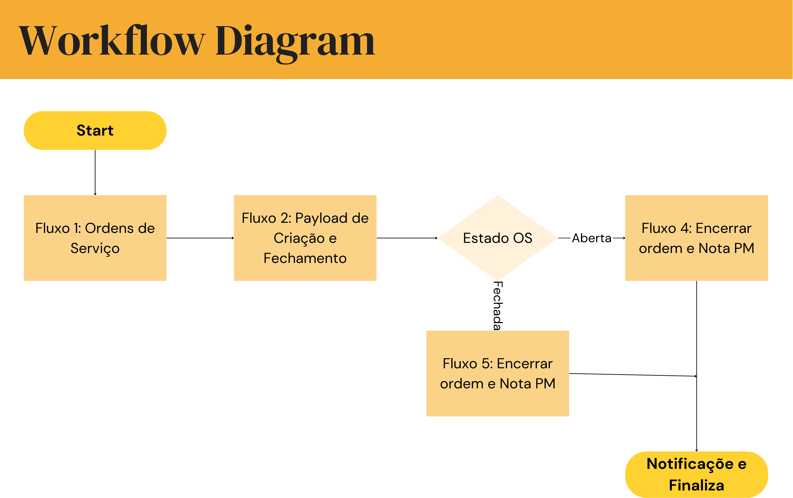

# Arquitetura do Sistema

## Visão Geral da Arquitetura

A integração entre o Arkmeds e o SAP é realizada através de uma aplicação construída em Node-RED, hospedada em um servidor autogerenciado. A aplicação utiliza WebSockets e APIs REST para comunicação, além de realizar diversas validações e transformações de dados.

## Diagrama de Arquitetura

*Nota: Insira aqui um diagrama ilustrando a arquitetura geral do sistema, mostrando os componentes principais e as interações entre eles. O diagrama deve destacar o fluxo de dados desde o Arkmeds, passando pelo Node-RED, até o SAP.*

## Componentes Principais

- **Arkmeds**: Sistema de gerenciamento de Ordens de Serviço utilizado na fábrica.
- **Node-RED**: Plataforma utilizada para orquestrar os fluxos de integração, processando e transformando dados.
- **WebSocket**: Protocolo utilizado para comunicação em tempo real entre o Arkmeds e o Node-RED.
- **SAP**: Sistema de gestão empresarial onde as OS precisam ser refletidas.
- **Servidor Autohospedado**: Ambiente onde a aplicação Node-RED está executando.

## Fluxo de Dados

1. **Criação/Atualização de OS no Arkmeds**: Quando uma OS é criada ou atualizada, o Arkmeds envia uma notificação.
2. **Recepção pelo Node-RED**: A aplicação captura essa notificação via WebSocket ou API.
3. **Processamento e Validação**: Os dados são processados, validados e transformados conforme necessário.
4. **Integração com o SAP**: O Node-RED envia os dados para o SAP, criando ou fechando OS correspondentes.
5. **Feedback e Notificações**: O sistema pode enviar confirmações ou alertas em caso de erros.

*Nota: Detalhes adicionais sobre cada etapa podem ser adicionados conforme necessário.*

